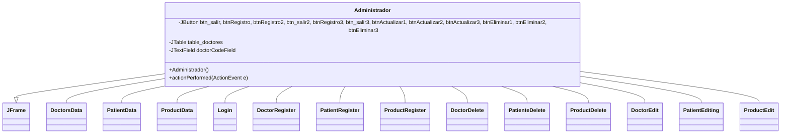
```mermaid
classDiagram
    Administrador --|> JFrame
    Administrador : -JButton btn_salir, btnRegistro, btnRegistro2, btn_salir2, btnRegistro3, btn_salir3, btnActualizar1, btnActualizar2, btnActualizar3, btnEliminar1, btnEliminar2, btnEliminar3
    Administrador : -JTable table_doctores
    Administrador : -JTextField doctorCodeField
    Administrador : +Administrador()
    Administrador : +actionPerformed(ActionEvent e)
    Administrador -- DoctorsData
    Administrador -- PatientData
    Administrador -- ProductData
    Administrador -- Login
    Administrador -- DoctorRegister
    Administrador -- PatientRegister
    Administrador -- ProductRegister
    Administrador -- DoctorDelete
    Administrador -- PatienteDelete
    Administrador -- ProductDelete
    Administrador -- DoctorEdit
    Administrador -- PatientEditing
    Administrador -- ProductEdit
```

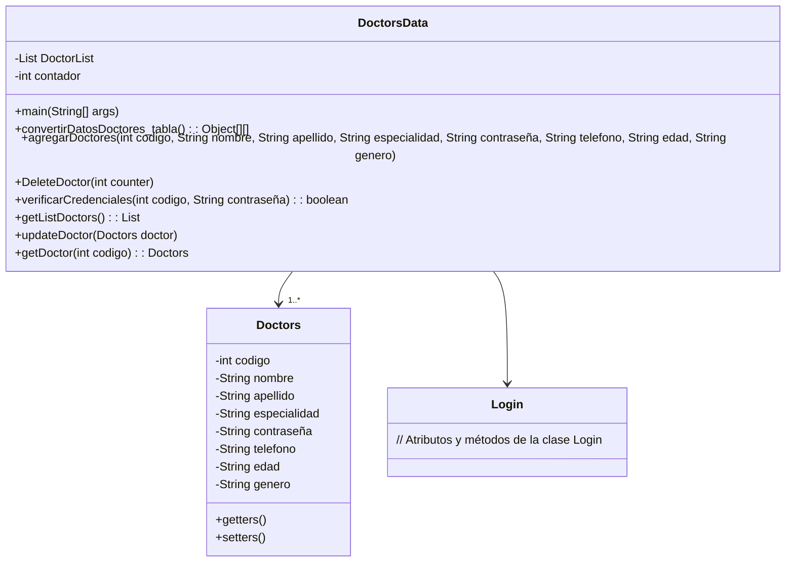
```mermaid
classDiagram
    class DoctorsData {
        -List<Doctors> DoctorList
        -int contador
        +main(String[] args)
        +convertirDatosDoctores_tabla(): Object[][]
        +agregarDoctores(int codigo, String nombre, String apellido, String especialidad, String contraseña, String telefono, String edad, String genero)
        +DeleteDoctor(int counter)
        +verificarCredenciales(int codigo, String contraseña): boolean
        +getListDoctors(): List<Doctors>
        +updateDoctor(Doctors doctor)
        +getDoctor(int codigo): Doctors
    }
    class Doctors {
        -int codigo
        -String nombre
        -String apellido
        -String especialidad
        -String contraseña
        -String telefono
        -String edad
        -String genero
        +getters()
        +setters()
    }
    class Login {
        // Atributos y métodos de la clase Login
    }

    DoctorsData --> "1..*" Doctors
    DoctorsData --> Login

```

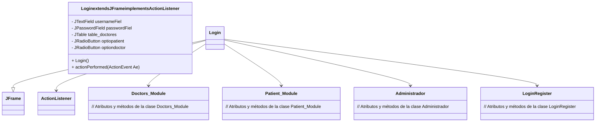
```mermaid
classDiagram
    class Login extends JFrame implements ActionListener {
        - JTextField usernameFiel
        - JPasswordField passwordFiel
        - JTable table_doctores
        - JRadioButton optiopatient
        - JRadioButton optiondoctor
        + Login()
        + actionPerformed(ActionEvent Ae)
    }

    class Doctors_Module {
        // Atributos y métodos de la clase Doctors_Module
    }

    class Patient_Module {
        // Atributos y métodos de la clase Patient_Module
    }

    class Administrador {
        // Atributos y métodos de la clase Administrador
    }

    class LoginRegister {
        // Atributos y métodos de la clase LoginRegister
    }

    Login --|> JFrame
    Login --> ActionListener
    Login --> Doctors_Module
    Login --> Patient_Module
    Login --> Administrador
    Login --> LoginRegister

```

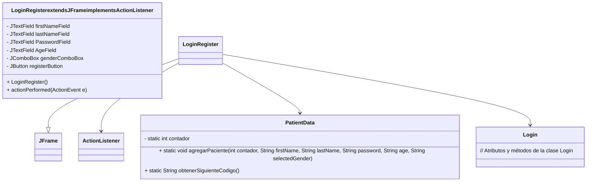
```mermaid
classDiagram
    class LoginRegister extends JFrame implements ActionListener {
        - JTextField firstNameField
        - JTextField lastNameField
        - JTextField PasswordField
        - JTextField AgeField
        - JComboBox<String> genderComboBox
        - JButton registerButton
        + LoginRegister()
        + actionPerformed(ActionEvent e)
    }

    class PatientData {
        - static int contador
        + static void agregarPaciente(int contador, String firstName, String lastName, String password, String age, String selectedGender)
        + static String obtenerSiguienteCodigo()
    }

    class Login {
        // Atributos y métodos de la clase Login
    }

    LoginRegister --|> JFrame
    LoginRegister --> ActionListener
    LoginRegister --> PatientData
    LoginRegister --> Login

```

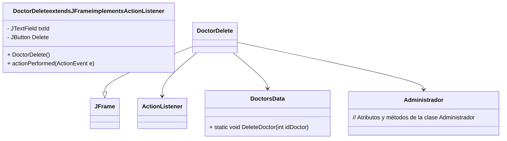
```mermaid
classDiagram
    class DoctorDelete extends JFrame implements ActionListener {
        - JTextField txtId
        - JButton Delete
        + DoctorDelete()
        + actionPerformed(ActionEvent e)
    }

    class DoctorsData {
        + static void DeleteDoctor(int idDoctor)
    }

    class Administrador {
        // Atributos y métodos de la clase Administrador
    }

    DoctorDelete --|> JFrame
    DoctorDelete --> ActionListener
    DoctorDelete --> DoctorsData
    DoctorDelete --> Administrador

```

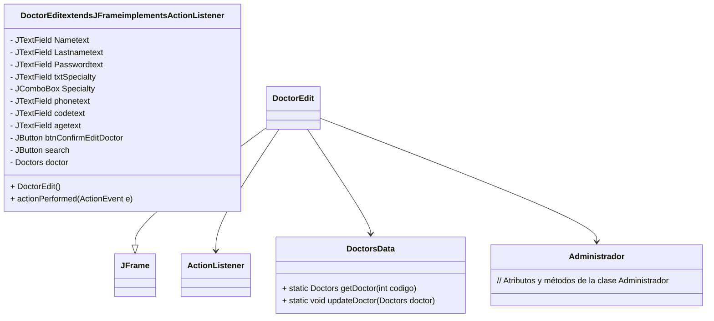
```mermaid
classDiagram
    class DoctorEdit extends JFrame implements ActionListener {
        - JTextField Nametext
        - JTextField Lastnametext
        - JTextField Passwordtext
        - JTextField txtSpecialty
        - JComboBox<String> Specialty
        - JTextField phonetext
        - JTextField codetext
        - JTextField agetext
        - JButton btnConfirmEditDoctor
        - JButton search
        - Doctors doctor
        + DoctorEdit()
        + actionPerformed(ActionEvent e)
    }

    class DoctorsData {
        + static Doctors getDoctor(int codigo)
        + static void updateDoctor(Doctors doctor)
    }

    class Administrador {
        // Atributos y métodos de la clase Administrador
    }

    DoctorEdit --|> JFrame
    DoctorEdit --> ActionListener
    DoctorEdit --> DoctorsData
    DoctorEdit --> Administrador

```

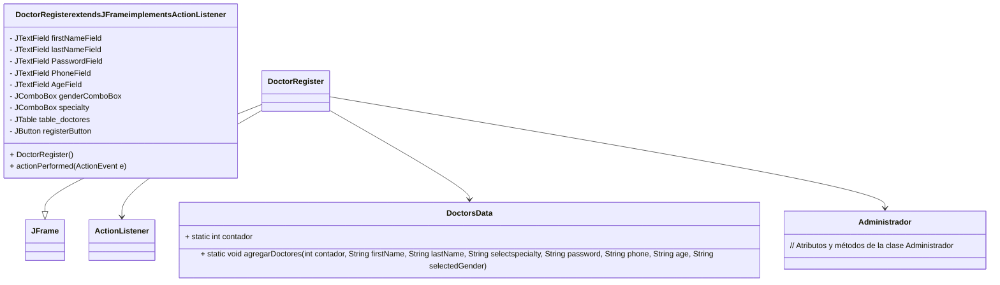
```mermaid
classDiagram
    class DoctorRegister extends JFrame implements ActionListener {
        - JTextField firstNameField
        - JTextField lastNameField
        - JTextField PasswordField
        - JTextField PhoneField
        - JTextField AgeField
        - JComboBox<String> genderComboBox
        - JComboBox<String> specialty
        - JTable table_doctores
        - JButton registerButton
        + DoctorRegister()
        + actionPerformed(ActionEvent e)
    }

    class DoctorsData {
        + static void agregarDoctores(int contador, String firstName, String lastName, String selectspecialty, String password, String phone, String age, String selectedGender)
        + static int contador
    }

    class Administrador {
        // Atributos y métodos de la clase Administrador
    }

    DoctorRegister --|> JFrame
    DoctorRegister --> ActionListener
    DoctorRegister --> DoctorsData
    DoctorRegister --> Administrador

```

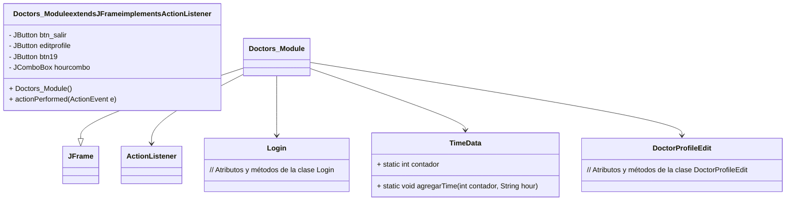
```mermaid
classDiagram
    class Doctors_Module extends JFrame implements ActionListener {
        - JButton btn_salir
        - JButton editprofile
        - JButton btn19
        - JComboBox<String> hourcombo
        + Doctors_Module()
        + actionPerformed(ActionEvent e)
    }

    class Login {
        // Atributos y métodos de la clase Login
    }

    class TimeData {
        + static void agregarTime(int contador, String hour)
        + static int contador
    }

    class DoctorProfileEdit {
        // Atributos y métodos de la clase DoctorProfileEdit
    }

    Doctors_Module --|> JFrame
    Doctors_Module --> ActionListener
    Doctors_Module --> Login
    Doctors_Module --> TimeData
    Doctors_Module --> DoctorProfileEdit

```

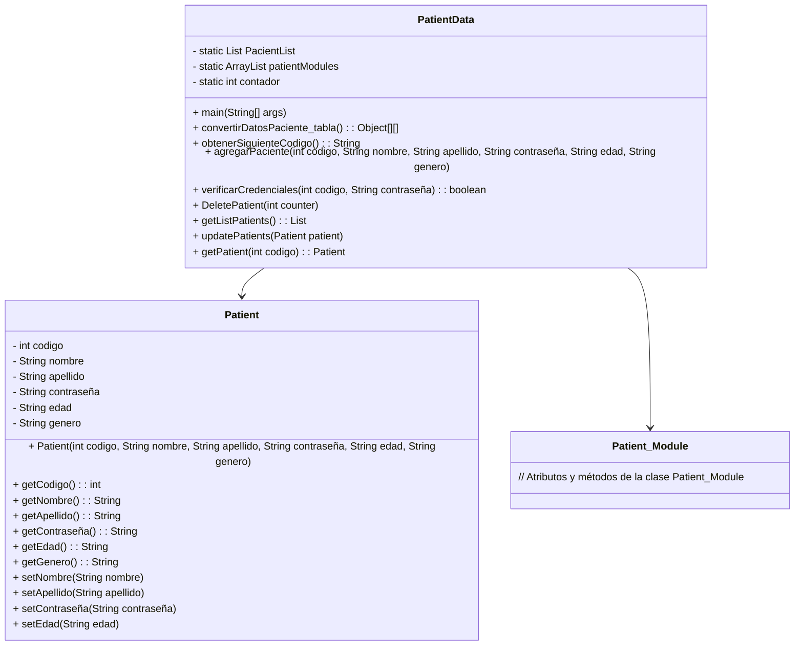
```mermaid
classDiagram
    class PatientData {
        - static List<Patient> PacientList
        - static ArrayList<Patient_Module> patientModules
        - static int contador
        + main(String[] args)
        + convertirDatosPaciente_tabla(): Object[][]
        + obtenerSiguienteCodigo(): String
        + agregarPaciente(int codigo, String nombre, String apellido, String contraseña, String edad, String genero)
        + verificarCredenciales(int codigo, String contraseña): boolean
        + DeletePatient(int counter)
        + getListPatients(): List<Patient>
        + updatePatients(Patient patient)
        + getPatient(int codigo): Patient
    }

    class Patient {
        - int codigo
        - String nombre
        - String apellido
        - String contraseña
        - String edad
        - String genero
        + Patient(int codigo, String nombre, String apellido, String contraseña, String edad, String genero)
        + getCodigo(): int
        + getNombre(): String
        + getApellido(): String
        + getContraseña(): String
        + getEdad(): String
        + getGenero(): String
        + setNombre(String nombre)
        + setApellido(String apellido)
        + setContraseña(String contraseña)
        + setEdad(String edad)
    }

    class Patient_Module {
        // Atributos y métodos de la clase Patient_Module
    }

    PatientData --> Patient
    PatientData --> Patient_Module

```

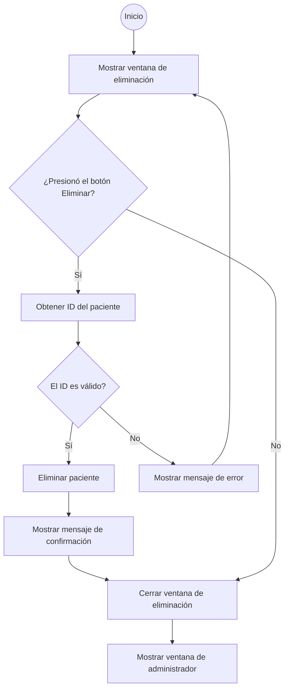
```mermaid
graph TD
    A((Inicio)) --> B[Mostrar ventana de eliminación]
    B --> C{¿Presionó el botón Eliminar?}
    C -->|Sí| D[Obtener ID del paciente]
    D --> E{El ID es válido?}
    E -->|Sí| F[Eliminar paciente]
    F --> G[Mostrar mensaje de confirmación]
    G --> H[Cerrar ventana de eliminación]
    H --> I[Mostrar ventana de administrador]
    E -->|No| I1[Mostrar mensaje de error]
    I1 --> B
    C -->|No| H

```

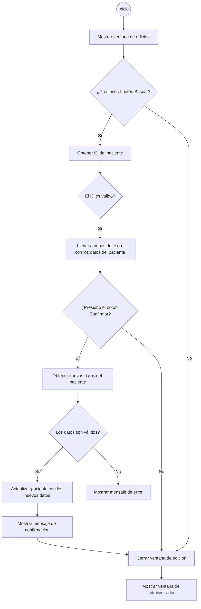
```mermaid
graph TD
    A((Inicio)) --> B[Mostrar ventana de edición]
    B --> C{¿Presionó el botón Buscar?}
    C -->|Sí| D[Obtener ID del paciente]
    D --> E{El ID es válido?}
    E -->|Sí| F[Llenar campos de texto con los datos del paciente]
    F --> G{¿Presionó el botón Confirmar?}
    G -->|Sí| H[Obtener nuevos datos del paciente]
    H --> I{Los datos son válidos?}
    I -->|Sí| J[Actualizar paciente con los nuevos datos]
    J --> K[Mostrar mensaje de confirmación]
    K --> L[Cerrar ventana de edición]
    L --> M[Mostrar ventana de administrador]
    I -->|No| I1[Mostrar mensaje de error]
    C -->|No| L
    G -->|No| L

```

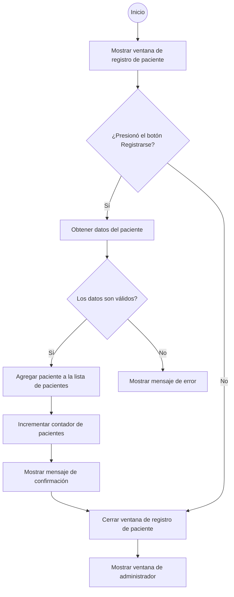
```mermaid
graph TD
    A((Inicio)) --> B[Mostrar ventana de registro de paciente]
    B --> C{¿Presionó el botón Registrarse?}
    C -->|Sí| D[Obtener datos del paciente]
    D --> E{Los datos son válidos?}
    E -->|Sí| F[Agregar paciente a la lista de pacientes]
    F --> G[Incrementar contador de pacientes]
    G --> H[Mostrar mensaje de confirmación]
    H --> I[Cerrar ventana de registro de paciente]
    I --> J[Mostrar ventana de administrador]
    E -->|No| I1[Mostrar mensaje de error]
    C -->|No| I

```

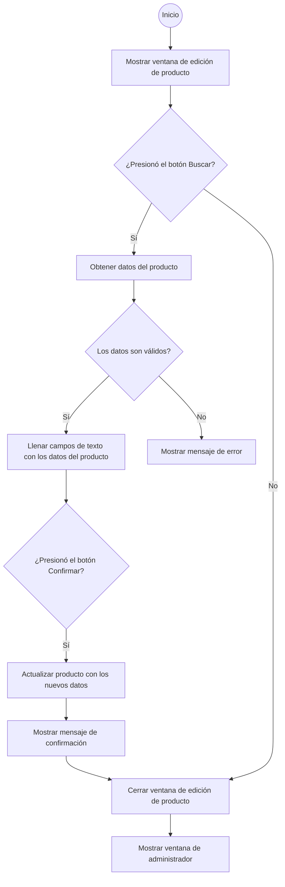
```mermaid
graph TD
    A((Inicio)) --> B[Mostrar ventana de edición de producto]
    B --> C{¿Presionó el botón Buscar?}
    C -->|Sí| D[Obtener datos del producto]
    D --> E{Los datos son válidos?}
    E -->|Sí| F[Llenar campos de texto con los datos del producto]
    F --> G{¿Presionó el botón Confirmar?}
    G -->|Sí| H[Actualizar producto con los nuevos datos]
    H --> I[Mostrar mensaje de confirmación]
    I --> J[Cerrar ventana de edición de producto]
    J --> K[Mostrar ventana de administrador]
    E -->|No| J1[Mostrar mensaje de error]
    C -->|No| J

```

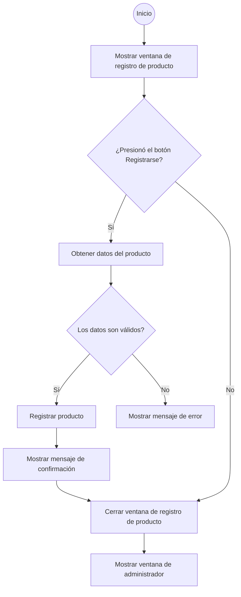
```mermaid
graph TD;
    A((Inicio)) --> B[Mostrar ventana de registro de producto];
    B --> C{¿Presionó el botón Registrarse?};
    C -->|Sí| D[Obtener datos del producto];
    D --> E{Los datos son válidos?};
    E -->|Sí| F[Registrar producto];
    F --> G[Mostrar mensaje de confirmación];
    G --> H[Cerrar ventana de registro de producto];
    H --> I[Mostrar ventana de administrador];
    E -->|No| H1[Mostrar mensaje de error];
    C -->|No| H;

```
